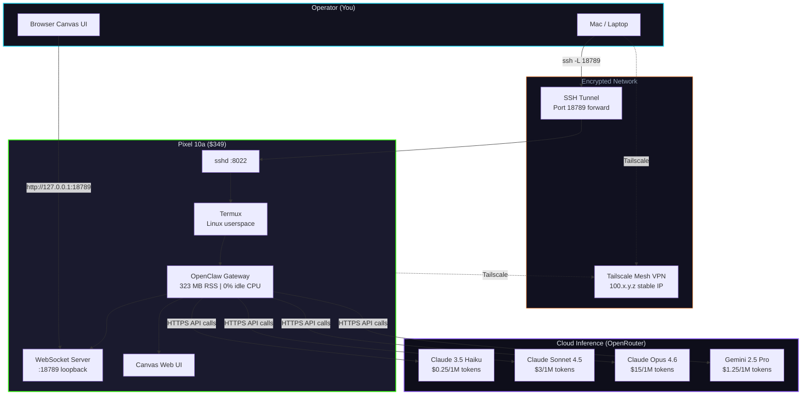
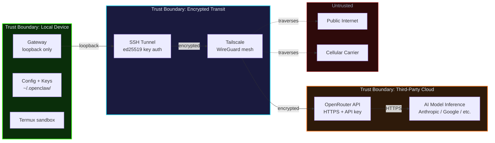
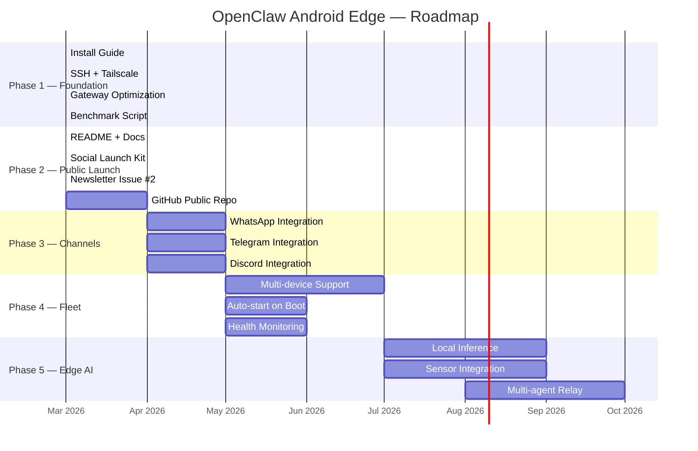

# Hero Diagram Specification

> Render-ready Mermaid diagrams for README and docs.
> Can also be exported to SVG/PNG for social previews.

---

## 1. Architecture Overview (for README)



---

## 2. Trust Boundaries (for docs/threat-model.md)



---

## 3. Progression Roadmap (for ROADMAP.md)



---

## 4. Cost Comparison (for README / social)

```mermaid
xychart-beta
    title "2-Year Total Cost: Phone vs Cloud VM"
    x-axis ["6 months", "12 months", "18 months", "24 months"]
    y-axis "Total Cost ($)" 0 --> 1200
    bar [409, 469, 529, 589]
    bar [330, 600, 870, 1140]
    legend ["Pixel 10a Edge Node", "Cloud VM (GCP e2-medium)"]
```

---

## Social Preview Image Spec

For the GitHub social preview (1280x640):

**Layout:**
- Dark background (#08080f)
- Left side: Pixel 10a device outline with terminal text
- Right side: Architecture flow arrows to cloud
- Top: "OpenClaw on Android" in bold
- Bottom: "Always-on AI edge node | $349 | No root required"
- Brand: spookyjuice.ai watermark bottom-right

**Colors:**
- Green (#39ff14) for terminal/tech elements
- Purple (#8b5cf6) for AI/cloud elements
- Cyan (#22d3ee) for network elements
- Orange (#f97316) for cost/value callouts

**Tools to render:**
- Figma, Excalidraw, or Canva
- Export as PNG 1280x640 for GitHub social preview
- Export as 1200x628 for X/LinkedIn cards
