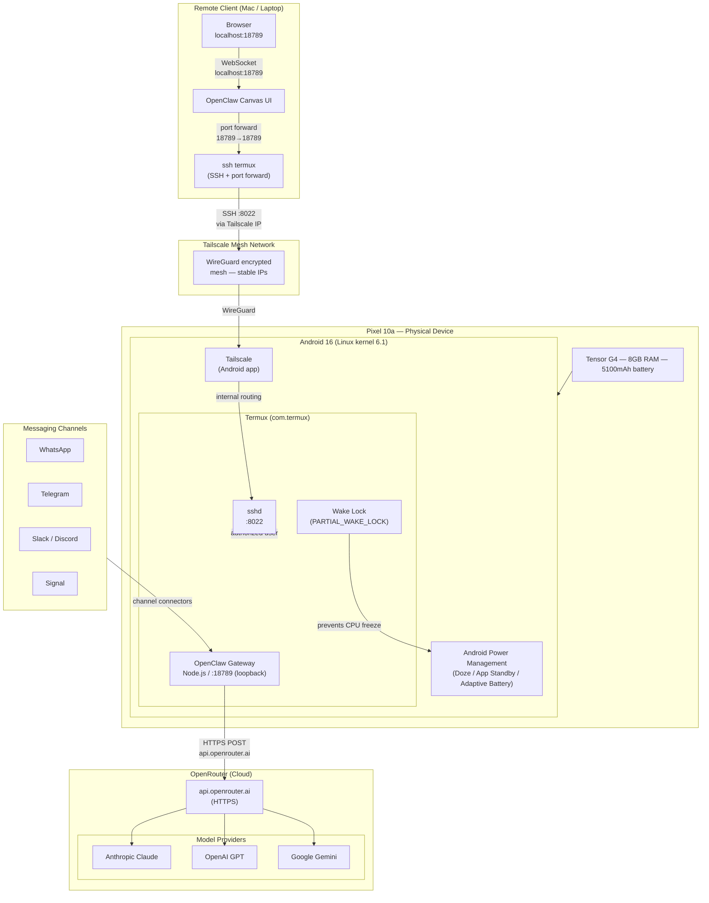
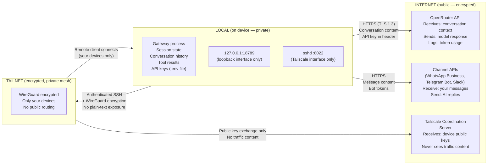

# System Architecture: OpenClaw on Pixel 10a

> **Author:** Brian Gorzelic / AI Aerial Solutions
> **Last Updated:** March 2026
> **Device:** Google Pixel 10a — Tensor G4, 8GB RAM, Android 16, Termux 0.118.3
> **OpenClaw Version:** 2026.3.2

---

## Table of Contents

1. [Overview](#overview)
2. [Layer 1: Phone Hardware](#layer-1-phone-hardware)
3. [Layer 2: Android Runtime](#layer-2-android-runtime)
4. [Layer 3: Termux and the Linux Environment](#layer-3-termux-and-the-linux-environment)
5. [Layer 4: OpenClaw Gateway](#layer-4-openclaw-gateway)
6. [Layer 5: OpenRouter Cloud Inference](#layer-5-openrouter-cloud-inference)
7. [Layer 6: Remote Access (SSH + Tailscale)](#layer-6-remote-access-ssh--tailscale)
8. [Layer 7: Canvas Web UI](#layer-7-canvas-web-ui)
9. [Full System Diagram](#full-system-diagram)
10. [Trust Boundary Diagram](#trust-boundary-diagram)
11. [Data Flow: A Request End to End](#data-flow-a-request-end-to-end)
12. [Key Design Decisions](#key-design-decisions)
13. [Measured Performance Characteristics](#measured-performance-characteristics)

---

## Overview

This system turns a $349 Android phone into an always-on AI gateway. The phone runs no AI models locally — it acts as a relay between your messaging channels (WhatsApp, Telegram, Slack, etc.) and cloud inference providers (accessed via OpenRouter). The gateway handles WebSocket connections, session state, tool orchestration, and routing. The actual language model computation happens in the cloud.

The architecture is intentionally shallow. There are no microservices, no databases requiring administration, no container orchestration. The entire stack runs as a single Node.js process inside Termux. This is a feature, not a limitation: fewer moving parts means fewer failure modes on hardware you cannot easily restart by SSHing into a data center.

**Key figures from production measurement (2026-03-07):**

| Metric | Value |
|--------|-------|
| Gateway RSS | 323 MB |
| Gateway CPU at idle | 0.00% |
| HTTP latency (loopback) | 65ms average (131ms cold, 45-52ms warm) |
| Node.js threads | 11 |
| Open file descriptors | 30 |
| RAM available after all processes | ~910 MB |

---

## Layer 1: Phone Hardware

The Pixel 10a is the physical substrate. Its relevant characteristics for this use case are not the camera or display — they are the compute architecture, memory, and power envelope.

### CPU: Tensor G4 (codename: zumapro)

The Tensor G4 uses a tri-cluster ARM big.LITTLE arrangement:

```
Cores 0-3:  Cortex-A520  (0xd80)  — Efficiency cluster
Cores 4-6:  Cortex-A725  (0xd81)  — Mid-performance cluster
Core 7:     Cortex-X4    (0xd82)  — Prime core
```

For an always-on gateway workload, this layout is advantageous. When the phone is idle and the OpenClaw process is waiting for requests, Android's scheduler parks the work on the A520 efficiency cores. These cores consume milliwatts. When a chat request arrives and the gateway needs to parse JSON, manage WebSocket frames, and orchestrate tool calls, the scheduler migrates work to the A725 or X4 cores temporarily, then returns to efficiency cores.

The gateway process measured 0.00% CPU over a 5-second idle sample. This is not an artifact — it is the expected behavior of an I/O-bound process waiting on network calls to OpenRouter.

### Memory: 8GB LPDDR5

The kernel reports 7,737,544 kB (~7.37 GB). Android reserves roughly 1-1.5 GB for the kernel, GPU drivers, and core system services. After Android, Termux, and the OpenClaw gateway, approximately 910 MB remained available in the measured snapshot.

Android uses zRAM (compressed RAM) for swap. The swap partition is not disk-backed — it compresses inactive memory pages in RAM itself. The measured state showed 3.76 GB zRAM total, nearly fully utilized. This is normal and expected: Android aggressively moves cold pages to zRAM. It does not indicate memory pressure for the gateway process.

### Storage: 128GB UFS 3.1

The phone reports 228 GB formatted capacity (the filesystem overhead is minimal; this is consistent with 128 GB NAND with a partition layout). OpenClaw's node_modules install is 640 MB. Gateway config is under 1 MB. Storage is not a constraint.

### Power

The 5,100 mAh battery provides built-in UPS functionality. A USB-C PD charger keeps the battery at 100% during always-on operation while drawing approximately 5W at idle. This is less power than a Raspberry Pi 4 under similar conditions, with better memory bandwidth and a more sophisticated power management controller.

---

## Layer 2: Android Runtime

Android 16 sits between the hardware and the user-space processes. For this use case, Android is primarily an obstacle to work around rather than a platform to leverage. Its job is to manage the hardware; our job is to prevent it from killing the gateway process.

Android's power management stack has five independent layers, each of which can terminate or throttle background processes:

| Layer | Mechanism | What It Does | Our Countermeasure |
|-------|-----------|--------------|-------------------|
| **Doze** | `DeviceIdleController` | Defers network access, alarms, jobs when screen is off | `dumpsys deviceidle whitelist +com.termux` |
| **App Standby** | `UsageStatsService` | Restricts apps not recently used by the user | `cmd appops set com.termux RUN_IN_BACKGROUND allow` |
| **Adaptive Battery** | ML-based `AppStandbyBucket` | Kills apps the model predicts are "not needed" | Settings > Apps > Termux > Battery > Unrestricted |
| **CPU Freeze** | Kernel `freezer` cgroup | Suspends process CPU time when screen is off | Termux wake lock (PARTIAL_WAKE_LOCK) |
| **WiFi Sleep** | `WifiStateMachine` | Disconnects WiFi when screen off to save power | `settings put global wifi_sleep_policy 2` |

All five must be addressed. Missing any one of them will result in the gateway going unreachable after a period of inactivity.

The gateway does not use Android APIs directly. It runs inside Termux, which appears to Android as a single application. From Android's perspective, the entire gateway is a foreground service notification associated with the `com.termux` package.

---

## Layer 3: Termux and the Linux Environment

Termux is the bridge between Android and a usable Linux environment. It is not a virtual machine or an emulator — it is a native Android application that provides a package manager, shell, and set of Linux tools compiled against Android's Bionic libc.

### What Termux Provides

- A bash/zsh shell running as an unprivileged Android app user (e.g., `u0_a314`)
- A package ecosystem (`pkg`) with ports of common Linux tools compiled for Bionic
- `sshd` running on port 8022 (unprivileged port, no root required)
- `termux-wake-lock` to hold a `PARTIAL_WAKE_LOCK` via Android's `PowerManager` API
- File storage at `/data/data/com.termux/files/` (app-private, survives reboots)

### Native Termux vs proot-distro

There are two ways to run Linux software in Termux: natively (compiled against Bionic) or inside proot-distro (a userspace chroot using a standard glibc-based distribution like Ubuntu).

For OpenClaw, **native Termux is required for the gateway process.** proot-distro fails at gateway startup because `os.networkInterfaces()` in Node.js issues a `getifaddrs()` syscall that proot's path translation intercepts incorrectly, returning EACCES (error 13). The gateway cannot determine what interfaces are available and exits.

Additionally, proot intercepts every syscall via ptrace, adding latency to all I/O operations. For a network-bound gateway process, this overhead is not acceptable.

The hybrid approach that works:

```
Termux (native):
  - sshd (port 8022)
  - OpenClaw gateway process
  - Startup scripts, wake lock management

proot-distro Ubuntu:
  - Development tools (Python, build utilities)
  - apt-installable packages not available in Termux pkg
  - One-off scripts that need glibc compatibility
```

### Why OpenClaw Needs proot for Installation but Not Runtime

OpenClaw's `koffi` dependency (a native FFI library) must compile from source during `npm install`. The Termux `make` and `cmake` have hardcoded paths pointing to Termux's file hierarchy (`/data/data/com.termux/files/usr/bin/sh`) rather than the standard `/bin/sh`. koffi's build system expects a standard POSIX layout and fails with Termux's variants.

The solution is to install OpenClaw inside proot-distro Ubuntu where the build environment is standard, then run it from native Termux by adding the proot Ubuntu binary paths to `$PATH`. In practice, OpenClaw's installed entry point at the system level works regardless of where node_modules was compiled, because the actual gateway binary does not dynamically link against glibc at runtime — Node.js handles that boundary.

> See [INSTALL-GUIDE.md](../INSTALL-GUIDE.md) Phase 4 and Phase 5 for the full installation path with documented failure modes.

---

## Layer 4: OpenClaw Gateway

OpenClaw is a Node.js application that runs as a persistent WebSocket server. It is the core of the system.

### Process Model

The gateway runs as a single Node.js process. Node.js uses a single-threaded event loop with libuv managing I/O operations on a thread pool. The measured process had 11 threads total: 1 event loop thread, 4 libuv I/O workers (default), and 6 additional threads for V8's garbage collector and internal timers.

This model is appropriate for the workload. The gateway spends nearly all of its time waiting on network I/O — either receiving WebSocket frames from clients or waiting for HTTP responses from the OpenRouter API. CPU computation (JSON parsing, message routing, context management) is brief and bursty.

### Gateway Configuration

The production configuration lives at `~/.openclaw/openclaw.json`:

```json
{
  "agents": {
    "defaults": {
      "model": {
        "primary": "openrouter/anthropic/claude-3.5-haiku"
      },
      "compaction": {
        "mode": "safeguard"
      }
    }
  },
  "discovery": {
    "mdns": {
      "mode": "off"
    }
  },
  "gateway": {
    "port": 18789,
    "mode": "local",
    "bind": "loopback",
    "auth": {
      "mode": "none"
    }
  }
}
```

**Notable configuration choices:**

- `bind: loopback` — The gateway listens only on `127.0.0.1`. Nothing on the local network, Tailscale interface, or internet can reach it directly. All external access goes through the SSH tunnel.
- `auth.mode: none` — Authentication is disabled because the loopback binding makes it redundant. Adding token auth with a loopback-only socket would require every client (browser tab, SSH session) to manage the token, with no security benefit over the network.
- `discovery.mdns.mode: off` — Termux cannot send multicast packets (Android restricts multicast to privileged sockets). Without this setting, the gateway retries mDNS broadcast every 60 seconds and logs a warning each time, generating ~1,440 useless log lines per day.
- `compaction.mode: safeguard` — Automatically compacts context when the conversation approaches the model's context window limit. Without this, long conversations would fail with a context overflow error.

### What the Gateway Does

1. **Channel management** — Maintains persistent connections to messaging platforms (WhatsApp, Telegram, Slack, Discord, Signal, etc.). Incoming messages from any channel are routed to the appropriate agent session.

2. **Session management** — Each conversation has a session with context history, active tools, and model selection. Sessions persist across gateway restarts via disk-backed state in `~/.openclaw/`.

3. **Tool orchestration** — When the model decides to use a tool (web search, file access, code execution, API call), the gateway handles the tool dispatch, waits for the result, and feeds it back to the model in the next turn.

4. **Model relay** — The gateway translates between its internal message format and the API format required by the target model provider. With OpenRouter, this is a single HTTP call with a JSON body. The gateway does not stream tokens for efficiency on mobile connections — it receives the complete response and sends it to the client.

5. **WebSocket server** — Clients (Canvas UI, other applications) connect via WebSocket on port 18789. The gateway manages connection state and pushes updates as they arrive from the model.

### Memory Footprint

The measured RSS of 323 MB breaks down approximately as:

| Component | Approximate Size |
|-----------|-----------------|
| V8 heap (JavaScript objects, strings, closures) | ~150-180 MB |
| Node.js native bindings and libuv | ~30 MB |
| koffi FFI library | ~40 MB |
| node_modules loaded into memory | ~60 MB |
| OS page cache, stack, other | ~20 MB |

The Node.js heap is capped with `NODE_OPTIONS="--max-old-space-size=256"` to prevent unbounded growth during long sessions with large context windows.

---

## Layer 5: OpenRouter Cloud Inference

OpenRouter is an API aggregator that provides a unified endpoint for 100+ language models from providers including Anthropic, OpenAI, Google, Meta, Mistral, and others. The gateway communicates with OpenRouter over HTTPS.

### Why OpenRouter Instead of Direct Provider APIs

1. **Single API key** — One key accesses all providers. No need to manage separate Anthropic, OpenAI, and Google credentials.
2. **Pay-per-token** — No monthly subscription. Cost is proportional to actual usage.
3. **Model switching** — Changing the active model is a config change, not a code change. The gateway format stays constant.
4. **Fallback routing** — OpenRouter handles provider outages by routing to alternative models when configured.
5. **Cost visibility** — The OpenRouter dashboard shows exactly what each conversation cost.

### Model Selection

The default model is `openrouter/anthropic/claude-3.5-haiku` — Anthropic's fastest, cheapest model. For most gateway tasks (message triage, quick Q&A, drafting short replies), Haiku is sufficient. More capable models are available for specific tasks:

| Model | Input Cost (1M tokens) | Best For |
|-------|----------------------|----------|
| `openrouter/anthropic/claude-3.5-haiku` | ~$0.25 | Quick tasks, triage, drafting |
| `openrouter/anthropic/claude-sonnet-4-5` | ~$3.00 | Code, analysis, complex reasoning |
| `openrouter/google/gemini-2.5-pro` | ~$1.25 | Large context, multimodal |
| `openrouter/meta-llama/llama-3.1-70b` | ~$0.35 | Open model, no data retention |

The phone performs no inference. It sends the conversation context and receives the model's response. The computational load on the phone per request is limited to serializing and deserializing JSON.

### Network Path

```
Gateway (Termux) → HTTPS POST → api.openrouter.ai → Model Provider → Response
```

Latency from the phone to OpenRouter is dominated by the OpenRouter-to-provider hop and model inference time. Typical end-to-end latency for a Claude 3.5 Haiku response is 1-4 seconds. The phone's contribution to that latency is under 100ms for the HTTPS round trip.

---

## Layer 6: Remote Access (SSH + Tailscale)

The gateway binds only to loopback. Remote access requires a tunnel. The tunnel is an SSH port forward, and stable addressing across networks is provided by Tailscale.

### Tailscale

Tailscale creates a WireGuard-based mesh network (a "tailnet") across your devices. Every device gets a stable IP in the `100.x.y.z` range that persists regardless of what physical network it is on. The Pixel 10a always has the same tailnet IP whether it is on home WiFi, a coffee shop network, or cellular.

Tailscale is installed as a native Android app from the Play Store. It must be configured with:
- **Always-on VPN** in Android settings (prevents Android from stopping Tailscale when the screen is off)
- **Battery: Unrestricted** (prevents Adaptive Battery from killing the Tailscale daemon)

### SSH Tunnel

The SSH connection serves two purposes: remote terminal access and port forwarding.

Port 18789 on the gateway (loopback-only) is forwarded to port 18789 on the connecting machine via:

```bash
ssh -N -L 18789:127.0.0.1:18789 termux
```

With `LocalForward` in `~/.ssh/config`, this forward is established automatically on every `ssh termux` connection:

```
Host termux
    HostName 100.x.y.z        # Tailscale stable IP
    Port 8022                  # Termux sshd port
    User u0_a314               # Android app user
    IdentityFile ~/.ssh/id_ed25519
    LocalForward 18789 127.0.0.1:18789
    IdentitiesOnly yes
```

### SSH on Port 8022

Termux's sshd runs on port 8022 because port 22 requires root to bind (ports below 1024 are privileged on Linux). This is a cosmetic difference — port 8022 behaves identically to port 22 from the client's perspective.

Authentication is key-only. Password authentication should be disabled after the initial setup.

### Access Patterns

There are three supported remote access modes, in order of preference:

**Mode 1: SSH tunnel (recommended for interactive use)**
```
Mac browser → localhost:18789 → SSH tunnel → Pixel:18789 (loopback)
```
No gateway configuration change required. Works from any device on the tailnet.

**Mode 2: Tailscale Serve (recommended for always-on shared access)**
The gateway is exposed at a stable HTTPS URL on the tailnet via Tailscale's Serve feature:
```
openclaw config set gateway.tailscale.mode serve
```
The canvas is accessible at `https://<hostname>.tailnet-name.ts.net/` from any tailnet device without an active SSH session.

**Mode 3: Direct tailnet binding (for API automation)**
The gateway binds to the Tailscale interface IP with token authentication:
```
openclaw config set gateway.bind tailnet
openclaw config set gateway.auth.mode token
```
Useful for automated clients that cannot manage SSH connections.

---

## Layer 7: Canvas Web UI

OpenClaw's Canvas is a browser-based chat and configuration interface served by the gateway. It is accessed at:

```
http://127.0.0.1:18789/__openclaw__/canvas/
```

The Canvas is a single-page application served as static assets from within the gateway process. It communicates with the gateway via WebSocket on the same port. The WebSocket connection carries:

- Chat messages (user input, model responses, tool results)
- Session events (typing indicators, connection status)
- Configuration updates
- Real-time log streaming

The Canvas does not communicate with OpenRouter directly. All model interaction goes through the gateway WebSocket → gateway → OpenRouter. This means the Canvas is stateless from a model perspective — the gateway holds all session state.

---

## Full System Diagram



---

## Trust Boundary Diagram

This diagram shows what runs locally on the phone versus what touches the internet, and what data crosses each boundary.



**What never leaves the device:**
- Session state and conversation history (stored in `~/.openclaw/`)
- API keys (stored in `~/.openclaw/.env`)
- Gateway configuration
- Tool results and intermediate computation

**What leaves the device encrypted (Tailscale/WireGuard):**
- SSH session data (terminal output, port-forwarded traffic)
- Canvas UI traffic (same as above — it goes through the SSH tunnel)

**What leaves the device over public internet (HTTPS):**
- Conversation context sent to OpenRouter with each API call. OpenRouter's data retention policies apply.
- Messages exchanged with channel APIs (Telegram, WhatsApp Business, Slack). Each platform's terms of service apply to message content.

---

## Data Flow: A Request End to End

The following describes what happens when a user types a message in the Canvas UI.

**Step 1: Browser sends WebSocket frame**
The Canvas (running in the browser on the Mac) sends a WebSocket text frame containing the message JSON to `ws://127.0.0.1:18789/ws`.

**Step 2: SSH port forward carries the frame to the phone**
The SSH connection's port forward transparently relays the frame over the encrypted WireGuard+SSH connection to the Pixel 10a. From the gateway's perspective, the connection originates from `127.0.0.1`.

**Step 3: Gateway receives and parses the message**
The Node.js event loop receives the WebSocket frame, parses the JSON, and adds the message to the current session's context window.

**Step 4: Gateway sends request to OpenRouter**
The gateway makes an HTTPS POST to `api.openrouter.ai/api/v1/chat/completions` with:
- The full conversation history
- The configured model name
- Any tool definitions the session has loaded
- The OpenRouter API key in the `Authorization` header

**Step 5: OpenRouter routes to the model provider**
OpenRouter forwards the request to the appropriate provider (e.g., Anthropic) and waits for the response.

**Step 6: Model generates response**
The model processes the context and returns either a text response or a tool call request.

**Step 7: Gateway receives response**
The gateway receives the HTTP response from OpenRouter, parses the model output. If the response is a tool call, the gateway dispatches the tool, waits for the result, and loops back to Step 4 with the tool result appended to context. If the response is text, it proceeds to Step 8.

**Step 8: Gateway sends response over WebSocket**
The gateway serializes the response and sends it as a WebSocket frame to the Canvas client.

**Step 9: Canvas renders the response**
The browser renders the message in the conversation UI.

Total time from user input to rendered response: 1.5-5 seconds, dominated by model inference time at the provider. Gateway processing and network overhead add less than 200ms combined.

---

## Key Design Decisions

### "No local inference" as a constraint, not a compromise

Running local models on a phone is possible (llama.cpp can run quantized models on the Tensor NPU), but the practical tradeoffs are unfavorable for most use cases: 4-bit quantized 7B models are noticeably degraded relative to Claude Haiku, inference is 3-10x slower, and it consumes significant battery. At ~$5-15/month for cloud inference, the economics favor keeping the phone as a relay and paying for quality.

Local inference is on the roadmap as an option for air-gapped or privacy-sensitive deployments. It is not absent because it cannot work — it is absent because it is not yet the best default.

### Loopback binding with SSH tunnel over direct network exposure

The gateway never exposes a port on the local network interface. This eliminates the attack surface from devices on the same WiFi network. The SSH tunnel is the only access path, and SSH provides cryptographic authentication without requiring OpenClaw to implement its own.

### Single process over microservices

The gateway, channel connectors, tool runtime, and WebSocket server all live in one Node.js process. This simplifies operations considerably: there is one process to monitor, one log file to tail, one command to restart. On a phone where you cannot run a container orchestrator, this is not a compromise — it is the only architecture that makes operational sense.

### OpenRouter for model access

Direct provider integrations would require managing multiple API keys, different request formats, different error handling, and separate billing relationships. OpenRouter consolidates this behind a single endpoint. The tradeoff is a dependency on OpenRouter's availability and pricing, but their uptime record and the ability to configure model fallbacks mitigates this risk.

---

## Measured Performance Characteristics

The following metrics are from the benchmark snapshot captured 2026-03-07T16:15:06Z after optimization settings were applied.

**Memory:**
- Total system RAM: 7.56 GB (7,923,245,056 bytes)
- RAM used: 5.62 GB (74.4% utilization including zRAM)
- RAM available to new processes: 910 MB
- zRAM swap: 3.76 GB total, 3.76 GB used (fully utilized — normal for Android)
- Gateway RSS: 323 MB (4.1% of total RAM)

**Gateway process:**
- PID: 26321 (stable; process has not restarted)
- Uptime at capture: 611 seconds (~10 minutes post-start)
- Virtual memory size: 15.7 GB (normal for Node.js — this is address space reservation, not physical RAM)
- Threads: 11
- Open file descriptors: 30

**Latency (loopback HTTP, 5 samples):**
- Cold request (first hit): 131ms
- Warm requests: 45-53ms
- Average: 65ms

The first-request latency is elevated because the Node.js JIT compiler has not yet optimized the request-handling code paths. After one request, the JIT-compiled paths are cached and subsequent requests drop to the 45-52ms range.

**CPU:**
- 5-second idle sample: 0.00%
- The gateway consumes no measurable CPU when not actively processing a chat request.

**Disk:**
- OpenClaw install: 640 MB (node_modules)
- Gateway config (`~/.openclaw/`): 486 KB
- Total disk used: 23.4 GB / 228 GB (11%)
- Available: 205 GB

**Log health (post-optimization):**
- Log file: 24 lines, 2 KB (clean — no mDNS spam, no error storms)
- Error entries: 2 (startup-time warnings, not runtime errors)
- Bonjour/mDNS spam entries: 0 (correctly disabled)
- Client connection events: 5

---

*For installation instructions, see [INSTALL-GUIDE.md](../INSTALL-GUIDE.md).*
*For optimization settings and rationale, see [OPTIMIZATION-GUIDE.md](../OPTIMIZATION-GUIDE.md).*
*For security model details, see [docs/threat-model.md](./threat-model.md).*
